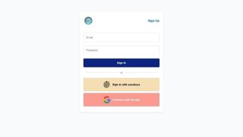

# AuthSystem
# OAuth2.0 & Passkeys Authentication App 🔑

This project demonstrates how to implement **OAuth2.0 authentication with Google** and **Passkeys-based authentication** using `@simplewebauthn/server`. The application provides a secure login and registration system using a combination of **traditional email-password login**, **Google OAuth2.0 login**, and **Passwordless Authentication (Passkeys)**.

---

---
## 📌 Features

- **Email & Password Authentication**: Standard registration and login.
- **Google OAuth2.0 Authentication**: Allow users to authenticate via their Google account.
- **Passkeys Authentication (FIDO2)**: Provide secure, passwordless login using WebAuthn.
- **JSON File Database**: Simple, file-based database (`users.json`) to store user credentials.
- **Secure Authentication Process**: Hashing passwords with bcrypt and using `@simplewebauthn/server` for handling WebAuthn requests.
- **Token Exchange with Google**: Uses Google's OAuth2.0 API to exchange authorization codes for access tokens.

---

## 🚀 Tech Stack

### Backend
- **Node.js** (Using Express)
- **bcrypt** (Password hashing)
- **@simplewebauthn/server** (For Passkeys authentication)
- **Google OAuth2.0 APIs** (For social login)
- **JSON Database** (`users.json`) for storing user data
